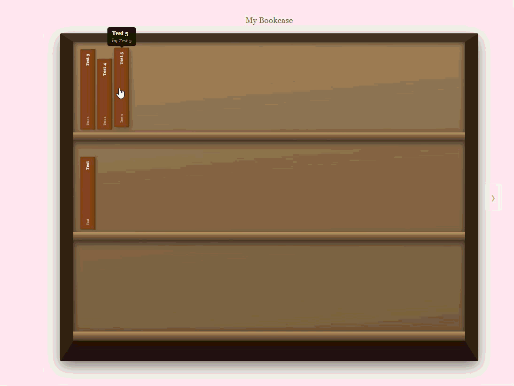

# NokkonenShelf

As someone who likes to read books on a tablet, I found myself wanting for a way that would let me visualize the books I've read or want to read in a way that a good old bookcase allows me to do. Therefore, this web app here has been created so that users can add books (metadata and not actual content of books) to virtual bookcases.

## Setting up development environment

You will need to have node installed as well as rust for the backend (used node version 24.14.0 and rust version 1.90.0 for development). You will also need to have docker and docker compose installed for dev database.

Then you will need to set up OAuth app. You can do so in github developer account settings (use http://localhost:5173/auth/github/callback as redirect url) and add GITHUB_CLIENT_ID/GITHUB_CLIENT_SECRET secrets to .env file in NokkonenShelfApi.

To start dev backend locally:
1) cd {NokkonenShelf root folder (where this readme is)}
2) docker-compose up -d
3) cd ./NokkonenShelfApi
4) cargo run

To start dev frontend locally:
1) cd {NokkonenShelf root folder (where this readme is)}/NokkonenShelfApp
2) npm run dev

Once you have ran these, you should have backend listening on localhost:3000 and frontend listening on localhost:5173.
